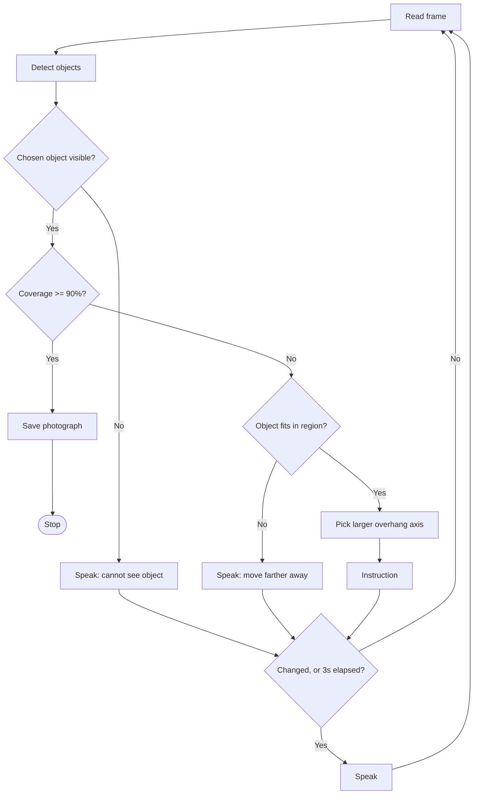

# Object Framing and Camera Guidance

How the app turns a YOLO detection into a spoken instruction, implemented in
[`framing.py`](../framing.py) and driven by `guide_to_frame()` in
[`main.py`](../main.py). This covers steps 8–12 of the
[pipeline](./pipeline.md).

## The region grid

`region_bbox(region, width, height)` converts a spoken region name into a pixel
box. The four quadrants tile the frame; the center is a separate, smaller box
straddling all four, so "center" is a real target rather than an ambiguous
corner.

| Region         | Box in a 640×480 frame     |
| -------------- | -------------------------- |
| `top left`     | `(0, 0, 320, 240)`         |
| `top right`    | `(320, 0, 640, 240)`       |
| `bottom left`  | `(0, 240, 320, 480)`       |
| `bottom right` | `(320, 240, 640, 480)`     |
| `center`       | `(214, 160, 426, 320)`     |

The center box is `CENTER_SCALE` (⅓) of the frame in each dimension. The frame
size is read from `frame.shape[:2]` every iteration rather than hardcoded,
because the webcam may not honor a requested resolution.

## The coverage metric

The assignment asks what percentage of the *object* sits in the chosen
location, so `coverage()` is intersection over the **object's** area, not IoU:

```
coverage = area(box ∩ region) / area(box)
```

Using IoU would let a large region dilute the score, and the app would refuse
to shoot a perfectly framed object. The photograph is taken once coverage
reaches `COVERAGE_TARGET` (90%).

## The direction rule

**Camera instructions are the opposite of the object's required travel.** When
the camera pans left, the scene shifts right in the frame, so an object that
needs to move right is reached by turning the camera *left*.

| Object must move | Camera instruction |
| ---------------- | ------------------ |
| right            | turn **left**      |
| left             | turn **right**     |
| up               | tilt **down**      |
| down             | tilt **up**        |

An easier way to keep it straight: *turn the camera toward the side of the
frame the object is already on.* This holds whether the user rotates the
camera or slides it sideways, so the instruction does not depend on guessing
which one they did.

## Measuring the error

`guidance()` measures the **overhang** — how far the object pokes outside the
region — rather than the distance between the object's center and the
region's center:

```python
dx = max(0, rx1 - bx1) - max(0, bx2 - rx2)
dy = max(0, ry1 - by1) - max(0, by2 - ry2)
```

Both terms cancel to zero exactly when the object is inside the region, which
is the same moment coverage reaches 100%. A center-to-center error can read as
"close enough" while the object still hangs over an edge, which would stall the
loop just short of the threshold.

Only the larger of the two errors is corrected per instruction, so the user is
given one step at a time instead of "left and up".

## Guard conditions

| Condition                          | Behavior                                    |
| ---------------------------------- | ------------------------------------------- |
| Object larger than the region       | "Move farther away from the object"         |
| Overhang below `DEADZONE` (3%)      | Treated as framed; stops left/right chatter |
| Object not detected this frame      | "I cannot see the &lt;object&gt;"           |
| `MAX_READ_FAILURES` reads in a row  | `latest()` raises; the camera feed is dead  |

The size guard is not optional. A quadrant is a quarter of the frame, so an
object that fills half the view can never reach 90% coverage and the user
would be nudged back and forth indefinitely.

## The guidance loop



### Divergence from `pipeline.md`

[`pipeline.md`](./pipeline.md) describes a stop-and-go cycle: instruct, wait
for the camera to move, wait for it to be stationary, then recapture. The
implementation instead re-detects continuously, so a correction is spoken the
moment the camera drifts rather than after a movement handshake. This is more
responsive and removes the motion-detection state machine entirely.

The tradeoff is that YOLO sometimes runs on motion-blurred frames and drops the
detection, which is why the "cannot see" branch exists. The stop-and-go design
avoids that at the cost of a slower interaction; it would be reinstated with a
mean-absolute-difference test between consecutive grayscale frames.

### Speech cadence

`SpeechIO.speak()` blocks until the phrase finishes, so speaking every frame
would produce a wall of audio and freeze the loop. An instruction is spoken
only when it **changes**, or every `REPEAT_SECONDS` (3s) to reassure a user who
is still moving.

### The camera thread

[`preview.py`](../preview.py) owns the camera on a background thread for the
whole run. The main thread blocks for seconds at a time on speech recognition,
TTS, and YOLO; if it also read the camera, frames would pile up in the driver's
buffer during those pauses and the first read afterward would return a stale
one showing where the camera *used* to point. The thread reads continuously,
so `Preview.latest()` is always the newest frame and nothing needs flushing.

With `--gui`, the same thread draws the live video. OpenCV windows must be
created and pumped from a single thread, and this one is never blocked, so the
video stays smooth even while the app is listening for a voice command. The
main thread never touches the window; it only hands over an `Overlay` (boxes,
target region, current instruction) that the thread draws on each frame.

### Object selection

If several instances of the chosen class are in view, the loop tracks the one
YOLO is most confident about. This is stable enough for a single object on a
desk; a scene with two similar objects would want `model.track(persist=True)`
so the identity survives across frames.

## Changes to existing files

| File          | Change                                                                    |
| ------------- | ------------------------------------------------------------------------- |
| `framing.py`  | New. Region geometry, coverage metric, and direction logic.                |
| `preview.py`  | New. Background camera thread; live `--gui` window with overlays.          |
| `main.py`     | Steps 1–3 now use the real camera and detector instead of a placeholder list; added `guide_to_frame()` for steps 8–13. |
| `camera.py`   | Split out `open_camera()` and `read_frame()`; `capture_image()` unchanged. |
| `debug.py`    | `debug_detect()` reuses `open_camera()`.                                   |

`camera.py` was split because the device streams to only one client at a time.
The original `capture_image()` opened and released the camera per call, which
would have fought with the long-lived handle the preview thread holds.

## Running it

```powershell
# Full pipeline, voice only
python main.py

# Same, with live video: every detected object after the first capture,
# then the target region, the tracked box, and the current instruction
python main.py --gui
```

In the `--gui` window, yellow is the region the user asked for and green is the
detected object. Press `q` or `Esc` to quit.
