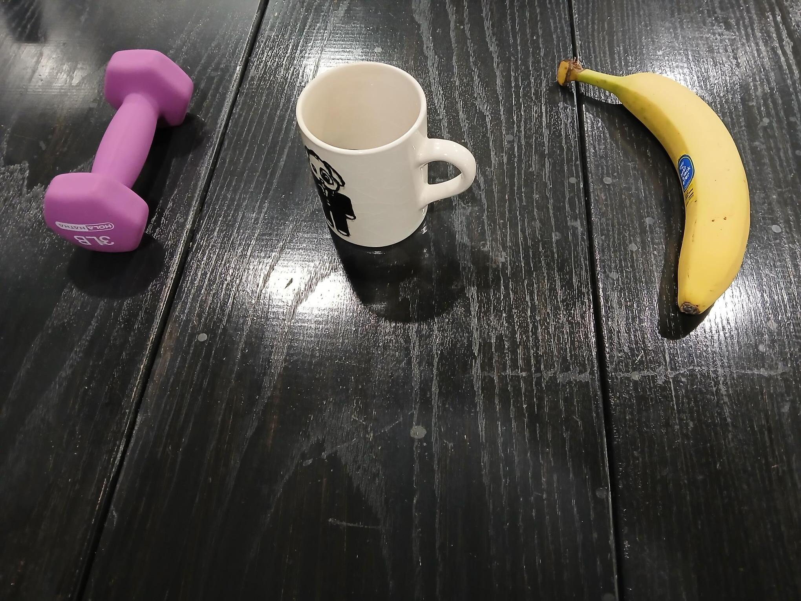
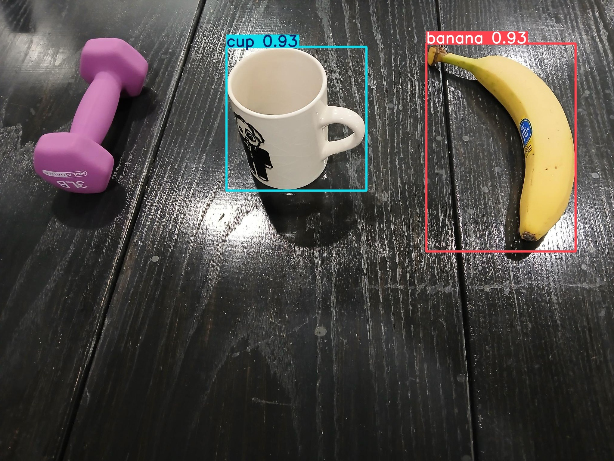

# Object Detection Information

## Instructor Snippet

The following is an example and code snippet pertaining to object detection provided by Dr. Banerjee:

### Example

> Some of you had questions on object detection. Here is a very simple example. The YOLO version I used does not detect the weight, but as you can see it gets the cup and banana in my image. Feel free to use this code and build from it for your project.

| Source Image             | Detections                   |
| ------------------------ | ---------------------------- |
|  |  |

### Snippet

```python
from ultralytics import YOLO

#Load an object detector
#See more: https://docs.ultralytics.com/tasks/detect
model = YOLO("yolov8n.pt")

#Run inference on an image 
results = model("image.jpg")

#Show results on screen
results[0].show()
results[0].save(filename="annotated_image.jpg")
```