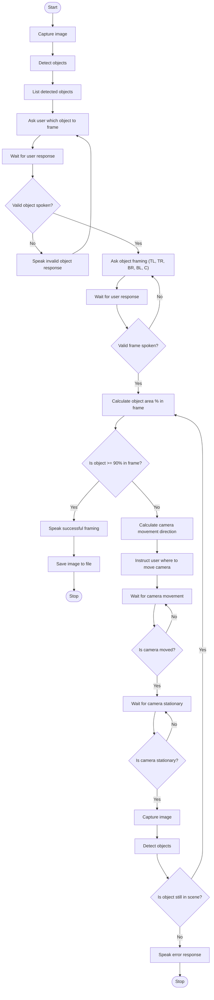

# Pipeline Flowchart

```mermaid
flowchart TD
    Start([Start]) --> Capture1[Capture image]
    Capture1 --> Detect1[Detect objects]
    Detect1 --> ListObjs[List detected objects]
    ListObjs --> AskObject[Ask user which object to frame]
    AskObject --> WaitResp1[Wait for user response]
    WaitResp1 --> ValidObj{Valid object spoken?}
    ValidObj -- No --> SpeakInvalid[Speak invalid object response]
    SpeakInvalid --> AskObject
    ValidObj -- Yes --> AskFraming["Ask object framing (TL, TR, BR, BL, C)"]
    AskFraming --> WaitResp2[Wait for user response]
    WaitResp2 --> ValidFrame{Valid frame spoken?}
    ValidFrame -- No --> AskFraming
    ValidFrame -- Yes --> CalcArea[Calculate object area % in frame]
    CalcArea --> IsObj90{Is object >= 90% in frame?}
    IsObj90 -- Yes --> SpeakSuccess[Speak successful framing]
    SpeakSuccess --> SaveImage[Save image to file]
    SaveImage --> Stop1([Stop])
    IsObj90 -- No --> CalcMove[Calculate camera movement direction]
    CalcMove --> InstructMove[Instruct user where to move camera]
    InstructMove --> WaitMove[Wait for camera movement]
    WaitMove --> IsMoved{Is camera moved?}
    IsMoved -- No --> WaitMove
    IsMoved -- Yes --> WaitStationary[Wait for camera stationary]
    WaitStationary --> IsStationary{Is camera stationary?}
    IsStationary -- No --> WaitStationary
    IsStationary -- Yes --> Capture2[Capture image]
    Capture2 --> Detect2[Detect objects]
    Detect2 --> IsInScene{Is object still in scene?}
    IsInScene -- Yes --> CalcArea
    IsInScene -- No --> SpeakError[Speak error response]
    SpeakError --> Stop2([Stop])
```